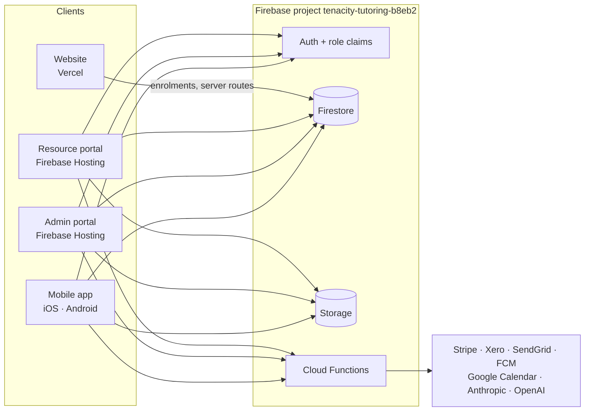
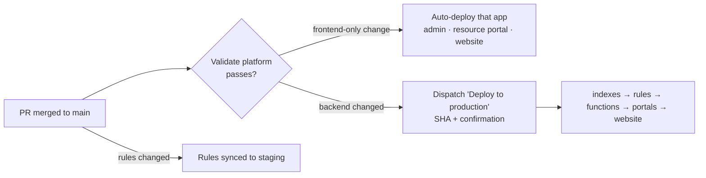

# Tenacity platform

Everything that runs Tenacity Tutoring, in one private monorepo: the mobile app
used by parents, students and tutors, the two staff web portals, the public
website, and the Firebase backend they all share. Every surface — including
the App Store and Play Store releases — ships from here.

- **New here?** Read [What's in the repo](#whats-in-the-repo) and
  [How it fits together](#how-it-fits-together), then
  [Getting started](#getting-started) for the app you're touching.
- **Shipping a change?** [Working in the repo](#working-in-the-repo) and
  [Deploying](#deploying).

## What's in the repo

| Path | What it is | Stack | Jira space |
| --- | --- | --- | --- |
| [`apps/mobile`](apps/mobile) | The Tenacity app for parents, students and tutors: timetable and class swaps, chat, announcements, invoices and Stripe payments, feedback, push notifications, plus admin tools on mobile | Flutter 3, Dart, pub | Mobile Application (`MOB`) |
| [`apps/admin-portal`](apps/admin-portal) | Back-office web app at `admin.tenacitytutoring.com`: enrolments and waitlist, people, classes and attendance, terms, invoices, announcements, weekly parent updates, feedback, audit, reports | React + Vite, npm | Admin Web Portal (`AWP`) |
| [`apps/resource-portal`](apps/resource-portal) | Teaching-resource generator at `resources.tenacitytutoring.com`: tutors and admins brief an AI, which produces worksheets and booklets as DOCX/PDF | React + Vite, npm | Resource Generator (`RES`) |
| [`apps/website`](apps/website) | Public marketing site and the online enrolment flow, with its own API routes (registration, parent feedback, Year 11 interest, enquiry email, unsubscribe) | Next.js 15, Yarn 1 | Website (`WEB`) |
| [`backend/firebase`](backend/firebase) | Cloud Functions, Firestore and Storage rules, Firestore indexes, Storage CORS, and the Functions inventory policy | Node.js 22, npm | Tenacity Platform (`TP`) |
| [`scripts/ci`](scripts/ci) | CI helpers: change detection, deploy-surface resolution, Firebase config and Functions-inventory checks (with tests) | Node.js | Tenacity Platform |
| [`scripts/firebase`](scripts/firebase) | Rules/index state and drift checks, deploy evidence, staging guards, provisioning scripts | Node.js, bash | Tenacity Platform |
| [`docs`](docs) | Architecture decisions, integration notes, operations runbooks, migration records | Markdown | — |
| [`.github/workflows`](.github/workflows) | Validation, production deploys and rollbacks, staging sync, drift checks | GitHub Actions | Tenacity Platform |

Root files:

- [`firebase.json`](firebase.json) / [`.firebaserc`](.firebaserc) — the only
  deployable Firebase manifest. Defines the Functions source, rules, indexes,
  the two Hosting targets (`admin-portal`, `resource-portal`) and emulator
  ports. The `default` alias is production; `staging` is the staging project.
- [`log.md`](log.md) — curated change log, newest first. Every piece of work
  adds an entry.
- [`CONTRIBUTING.md`](CONTRIBUTING.md), [`AGENTS.md`](AGENTS.md),
  [`CLAUDE.md`](CLAUDE.md) — contribution rules and instructions for AI agents.
  Each app also has its own `CLAUDE.md`.

### Backend at a glance

Functions live in [`backend/firebase/functions/src`](backend/firebase/functions/src),
one folder per domain:

| Domain | Covers |
| --- | --- |
| `attendance`, `classes`, `terms`, `students`, `enrolments` | Timetable, roll marking, term calendar, class swaps, enrolment lifecycle |
| `invoices`, `payments` | Invoicing, Stripe payments and one-off bookings, Xero |
| `chats`, `notifications`, `email` | Messaging, FCM push, SendGrid email (welcome, weekly parent update) |
| `resources` | AI resource generation (Anthropic and OpenAI), diagrams, maths rendering, DOCX/PDF building |
| `calendar` | One-way Google Calendar timetable export |
| `auth`, `users`, `audit`, `reports`, `shared` | Role claims, user management, audit trail, reporting, shared helpers |

The package entry point is `lib/index.js`. See
[`backend/firebase/README.md`](backend/firebase/README.md) for why `lib` and
`src` coexist, and the Functions inventory rules.

## How it fits together

- **One Firebase project** (`tenacity-tutoring-b8eb2`) backs every app: shared
  users, role claims, Firestore data, Storage and Functions.
- The **admin and resource portals are separate apps** on separate Hosting
  sites and origins. They share no code and no session — a test in each
  enforces that.
- The **website** is a Vercel project (`tenacity-tutoring-tqi9`) that writes
  enrolments to Firestore through `firebase-admin`.
- **Staging** is a second Firebase project, `tenacity-tutoring-staging`,
  holding synthetic seeded data. See [Environments](#environments).

## Getting started

There is no root workspace or root install. Work inside each app with its own
package manager.

| App | Prerequisites | Install and run | Local config |
| --- | --- | --- | --- |
| Mobile | Flutter 3.x, Xcode / Android Studio | `cd apps/mobile && flutter pub get && scripts/run.sh staging` | Tracked; `run.sh` picks the Firebase project |
| Admin portal | Node.js 22 | `npm ci --prefix apps/admin-portal && npm --prefix apps/admin-portal run dev` | Untracked `apps/admin-portal/.env` with `VITE_FIREBASE_*` — see its [README](apps/admin-portal/README.md#environment-variables) |
| Resource portal | Node.js 22 | `npm ci --prefix apps/resource-portal && npm --prefix apps/resource-portal run dev` | Untracked `apps/resource-portal/.env` — see its [README](apps/resource-portal/README.md#local-development) |
| Website | Node.js, Yarn 1 | `cd apps/website && yarn install --frozen-lockfile && yarn dev` (port 3003) | Untracked `.env.local` — see [environment variables](apps/website/docs/environment-variables.md) |
| Functions | Node.js 22, Firebase CLI | `npm ci --prefix backend/firebase/functions` | `backend/firebase/functions/.secret.local` for local secrets — see [backend README](backend/firebase/README.md) |

Mobile always takes an explicit environment: `scripts/run.sh staging` or
`scripts/run.sh prod`. It sets the build flavour and Dart environment together
so they can't disagree. Don't rerun `flutterfire configure` unless the Firebase
client config is meant to change.

## Environments

| | Staging | Production |
| --- | --- | --- |
| Firebase project | `tenacity-tutoring-staging` | `tenacity-tutoring-b8eb2` |
| Data | Synthetic, from `npm --prefix backend/firebase/functions run seed:staging`; term calendar synced nightly from production | Real users, real payments |
| Rules | Synced automatically on every merge that touches them | Deployed by dispatch, and only once staging already serves them |
| Used by | Mobile (`run.sh staging`); seeded accounts for testing | Everything live |

> **Local runs can write to production.** The portals and website use whatever
> Firebase config is in their local env file, and none of them connect to
> emulators automatically. A mutating flow against production config writes
> real data, calls real Functions, and can send email or start a payment. Use
> staging, the emulators, or an approved test method for anything that writes.

Runbooks: [mobile staging](docs/operations/mobile-staging-environment.md) ·
[Firebase staging rehearsal](docs/operations/firebase-staging-rehearsal.md).

## Testing and validation

`Validate platform` ([`validate.yml`](.github/workflows/validate.yml)) runs on
every PR and push to `main`, running only the jobs for areas that changed.
Locally, run the checks for each area you touched:

| Area | Commands |
| --- | --- |
| CI scripts | From the root: `node --test scripts/ci/test/*.test.mjs` · `node scripts/ci/check-functions-inventory.mjs` · `node scripts/ci/validate-firebase-config.mjs` |
| Mobile | From `apps/mobile`: `dart format --output=none --set-exit-if-changed lib test` · `flutter analyze --no-fatal-infos` · `flutter test` |
| Admin portal | `npm --prefix apps/admin-portal test` · `npm --prefix apps/admin-portal run build` · `npm --prefix apps/admin-portal run test:rules` when rules change |
| Resource portal | `npm --prefix apps/resource-portal test` · `npm --prefix apps/resource-portal run build` |
| Functions | `npm --prefix backend/firebase/functions test` · `npm --prefix backend/firebase/functions run smoke` · `npm --prefix backend/firebase/functions run test:emulator` when integration behaviour changes |
| Website | From `apps/website`: `yarn lint` · `yarn build` |

The emulator suites (`test:rules`, `test:emulator`) need the Firebase CLI, use
isolated `demo-*` project IDs, and share port 8080, so run them one at a time.
The admin portal has no lint script and the website has no test script.

## Deploying

| Surface | How it reaches production |
| --- | --- |
| Admin portal, resource portal, website | **Automatically** once `Validate platform` passes on `main`, if that app changed and the commit didn't touch the backend |
| Firestore indexes, rules, Cloud Functions | **Manual dispatch** of [`production-deploy.yml`](.github/workflows/production-deploy.yml) with the `main` SHA. It deploys what the commit changed, in dependency order |
| Mobile | **By hand:** bump `apps/mobile/pubspec.yaml`, run `flutter build ios --config-only`, archive in Xcode (untick *Manage Version and Build Number*), and submit to the stores |

Things worth knowing before you dispatch:

- The deploy resolves surfaces from the **last commit on `main`** and must be
  dispatched with `main`'s current HEAD. Land each change as one squashed PR
  that includes its log entry, so nothing lands between merge and deploy.
- Every production run opens and closes a deploy-record issue automatically.
- Rollback workflows exist for each portal's Hosting, for rules, and for the
  website. Functions roll back by redeploying the previous source; indexes
  are additive and are not rolled back.

Full controls, abort conditions and rollback steps:
[production deployment runbook](docs/operations/production-deployment-controls.md).

## Working in the repo

- **Branch from `main`, merge by PR.** `main` is protected; PRs are
  squash-merged. Use a prefix such as `feature/`, `fix/` or `docs/` plus the
  Jira key (e.g. `fix/res-31-maths-rendering`).
- **Name the Jira ticket** in the branch, commits and PR title, using the
  space in the table [above](#whats-in-the-repo). Cross-cutting work goes in
  Tenacity Platform (`TP`).
- **Update [`log.md`](log.md)** in the same PR: one entry per task, newest at
  the top, with the Index row.
- **Keep data changes additive.** Released mobile clients read the same
  Firestore, so readers stay tolerant until every client has the new contract.
- **Never deploy Firebase from an app directory** or with a bare
  `firebase deploy`. Production goes through the workflows above. Never touch
  the legacy `generateXeroAuthUrl` / `xeroOAuthCallback` Functions; this
  package doesn't own them.
- Ownership is documented in [`.github/CODEOWNERS`](.github/CODEOWNERS); the
  review and validation expectations are in [CONTRIBUTING.md](CONTRIBUTING.md).

## Docs index

| Doc | What it covers |
| --- | --- |
| [Production deployment](docs/operations/production-deployment-controls.md) | Auto-deploy rules, the orchestrator, per-surface controls, rollback |
| [Solo production authorization](docs/operations/solo-production-authorization.md) | How production changes are authorised while one person maintains the repo |
| [Branch protection](docs/operations/github-branch-protection.md) | `main` protection and environment settings |
| [Mobile staging](docs/operations/mobile-staging-environment.md) | Staging project, seeding, running the app against it |
| [Firebase staging rehearsal](docs/operations/firebase-staging-rehearsal.md) | Rules and index rehearsals on staging |
| [Backend README](backend/firebase/README.md) | Functions package, inventory, AI model switching, live resource smoke test |
| [Google Calendar export](docs/integrations/google-calendar-export.md) | One-way timetable sync to Google Calendar |
| [ADR-001](docs/architecture/ADR-001-monorepo-and-backend-ownership.md) | Why this is a monorepo and who owns the backend |
| [Migration records](docs/migrations) | The 2026 move from three repos into this one (historical) |
